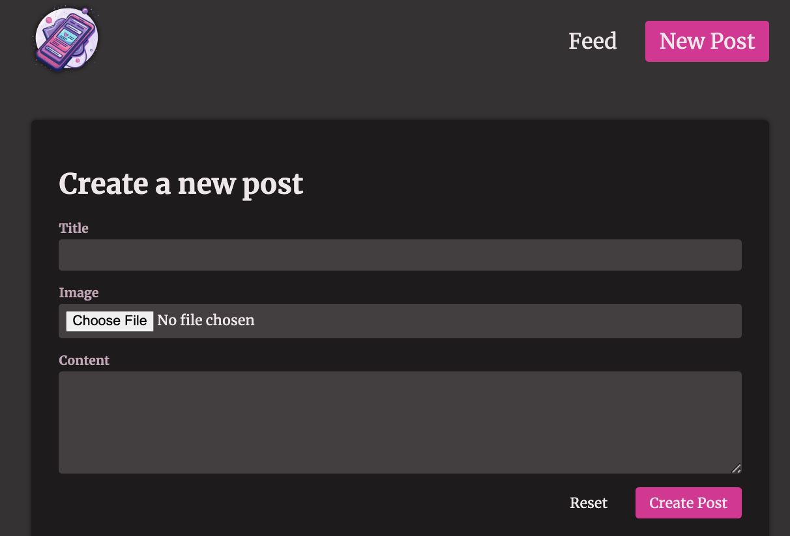

# Next Poster


A comprehensive demonstration of Next.js 15's data mutation, sending storing or changing data based on [Maximilian Schwarzmüller's Udemy course](https://www.udemy.com/course/react-the-complete-guide-incl-redux).

## Setup

1. Install dependencies:

   ```bash
   pnpm install
   ```

2. Initialize the SQLite database:
   ```bash
   pnpm db:init
   ```

3. Images will be stored in Cloudinary. Set up the following environment variables:

   ```bash
   CLOUDINARY_CLOUD_NAME=
   CLOUDINARY_API_KEY=
   CLOUDINARY_API_SECRET=
   CLOUDINARY_FOLDER=<your-folder-name-to-store-uploaded-images>
   ```

## Next Poster Demo

- **Next.js 15 Server Features**

  - App Router with file-based routing
  - Server Components as default (see feed page implementation)
  - Server Actions for post creation and like handling
  - Error Boundaries for graceful error handling
  - Loading UI with Suspense boundaries
  - Image optimization with Next/Image component

- **React Hooks & State Management**

  - `useActionState` for form submission handling
  - `useFormStatus` for pending state indication
  - `useOptimistic` for immediate UI updates on likes
  - `Suspense` for loading states
  - Form validation with server-side error handling

- **Data & Image Management**

  - SQLite database with `better-sqlite3`
  - Cloudinary integration for image uploads
  - Optimistic updates for like interactions
  - Cache revalidation with `revalidatePath`

## Screenshots

Posts Home


Posts Feed


New Post


